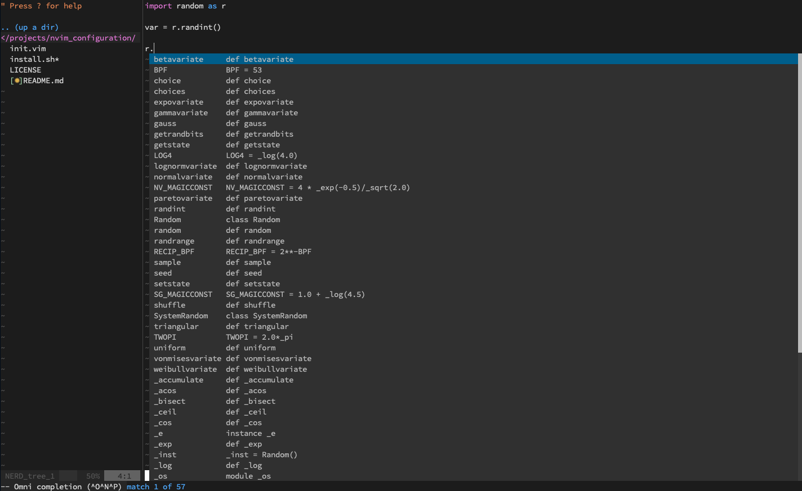
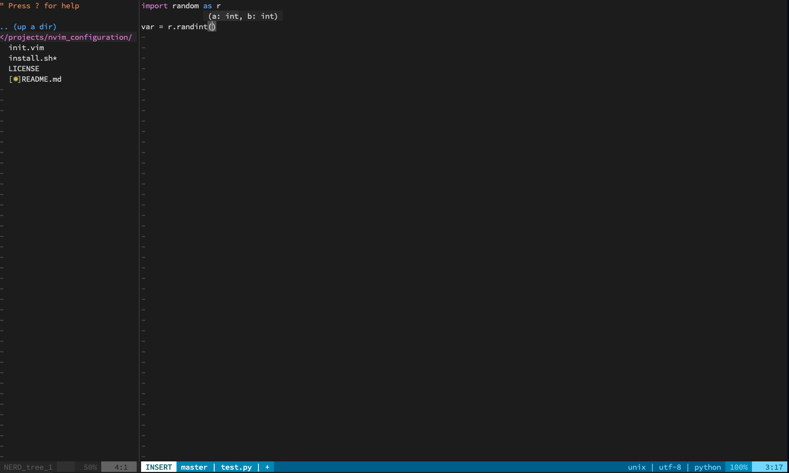

# NVIM setup on ubuntu

## Features
- Directories tree (NERDTree)
- Python jedi autocompletions (after `.` and with `tab`)
- Python linter (pylint)
- VSCode theme (ofcourse dark theme)
- Git branch information
- Fuzzy search (`ff` - search in files, `fd` - search files in directory)

## Prerequisites

- python3

## Installation

1. Run install.sh

```bash
./install.sh
```

2. Open editor with command `nvim test.py`, press `Enter`, then type `:PlugInstall`

3. Close editor and open it again. you should see something like this


